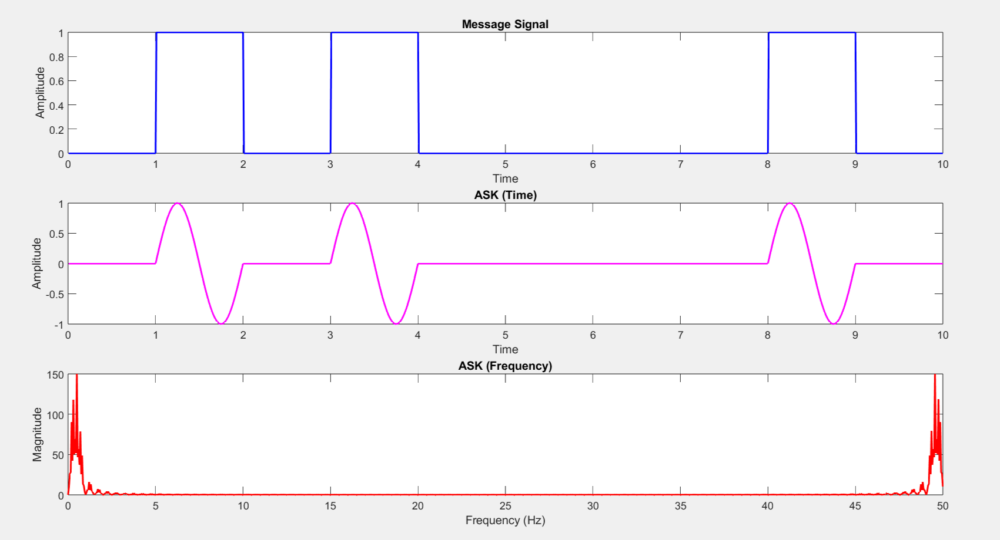
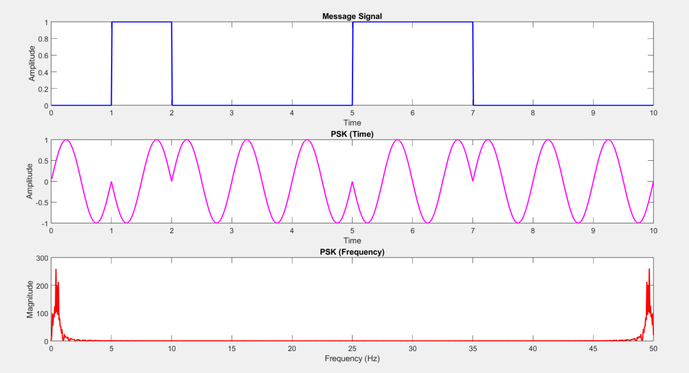
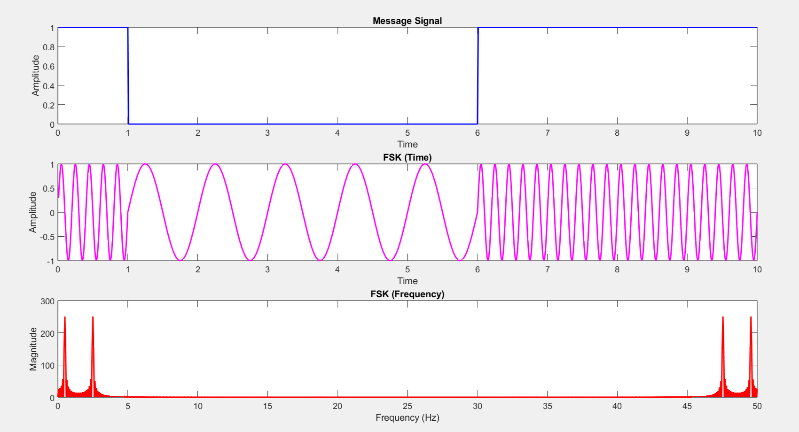
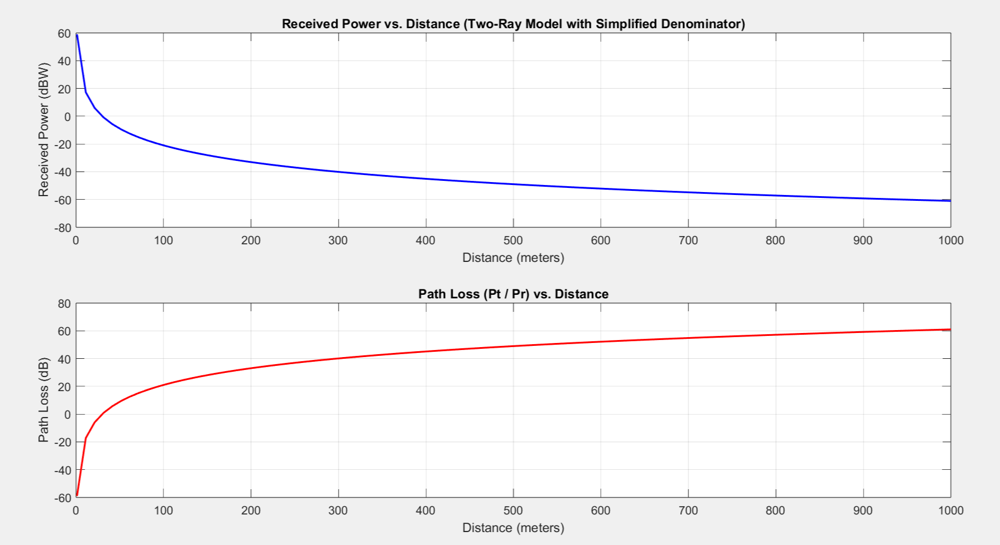

# Wireless Communication Lab

This repository contains **Wireless and Cellular Communication Laboratory** programs in **MATLAB**

**Experiments:**
- ASK, FSK, PSK
- CDMA
- Two-Ray Model
- Rayleigh, Rician
- BER, PER, Capacity, Throughput
- Equalizers
- OFMDM

---

---

## Technologies used:

- `MATLAB`

---

## Contributors

- Balaji

---

## License & Copyright

Copyright [©balaji](https://github.com/balajirai)

Licensed under the [MIT License](LICENCE)
